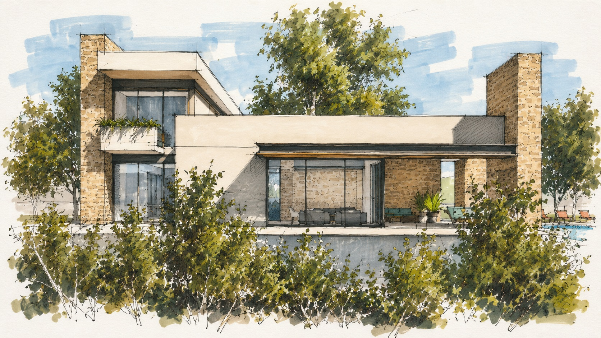
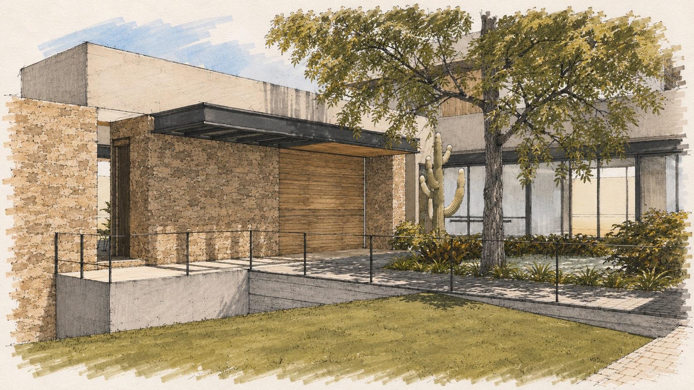
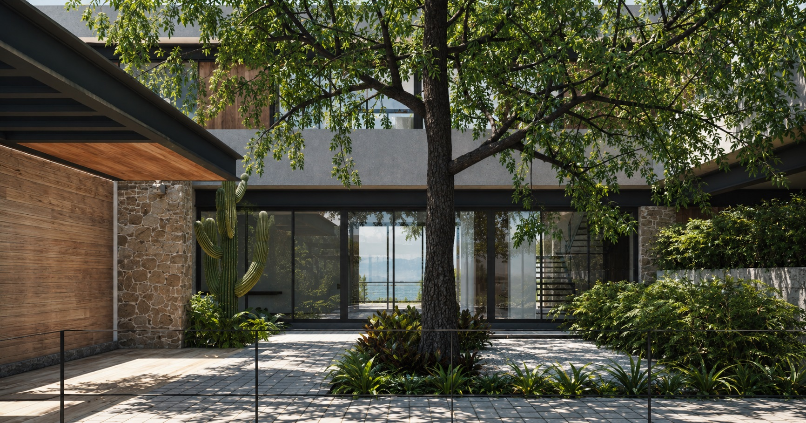
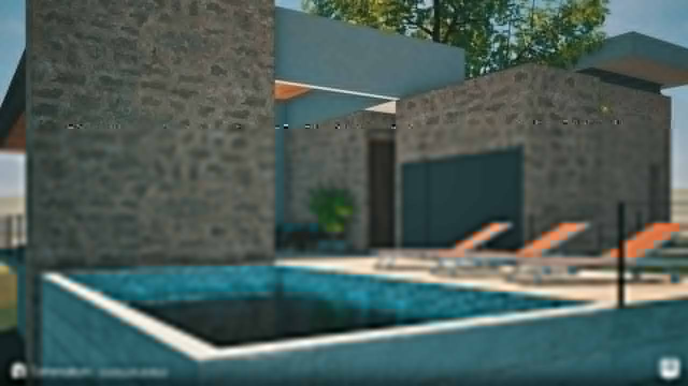

## Casa y paisaje
Casa Alborea se organiza como una secuencia de pabellones residenciales alrededor de patios, jardines y terrazas. Muros de piedra, planos claros y grandes paños de vidrio construyen una relación continua entre las áreas sociales, la alberca y el paisaje interior del conjunto.

## Desarrollo técnico
La participación de CR Collective se concentró en el modelado BIM coordinado, la documentación de instalaciones y la visualización exterior. El expediente integra criterios arquitectónicos con esquemas de aire acondicionado, hidráulica, sanitaria, gas, iluminación, voz y datos y red pluvial.

## Créditos
Autoría arquitectónica: D.arqs / Delgado Arquitectos. Participación de CR Collective: documentación BIM, coordinación de instalaciones y visualización. Las imágenes publicadas son proxies ligeros preparados para web y pueden sustituirse por los archivos originales conservando sus nombres.

## Galería

