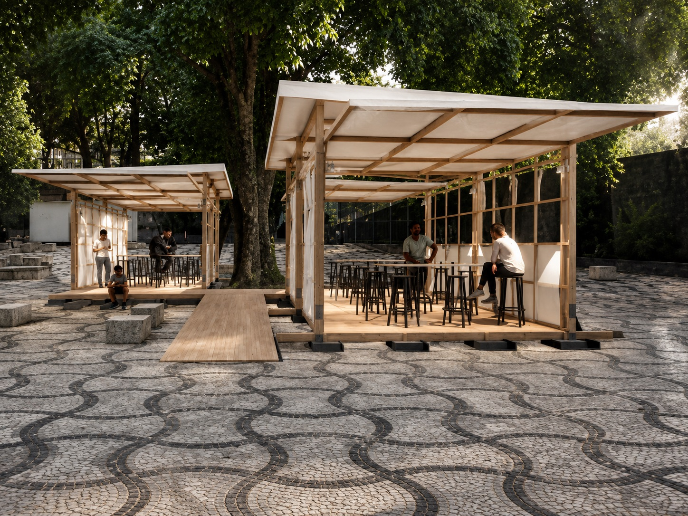
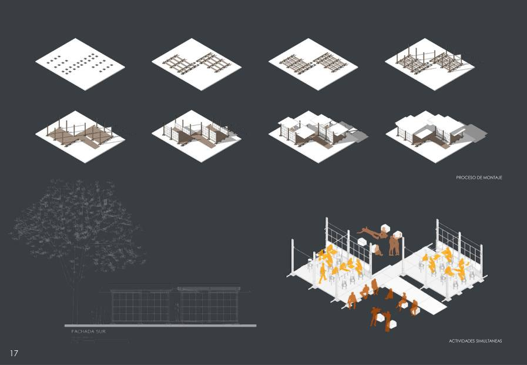
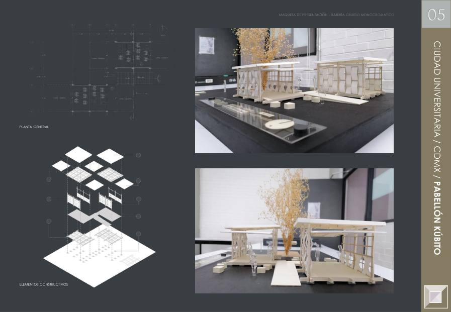
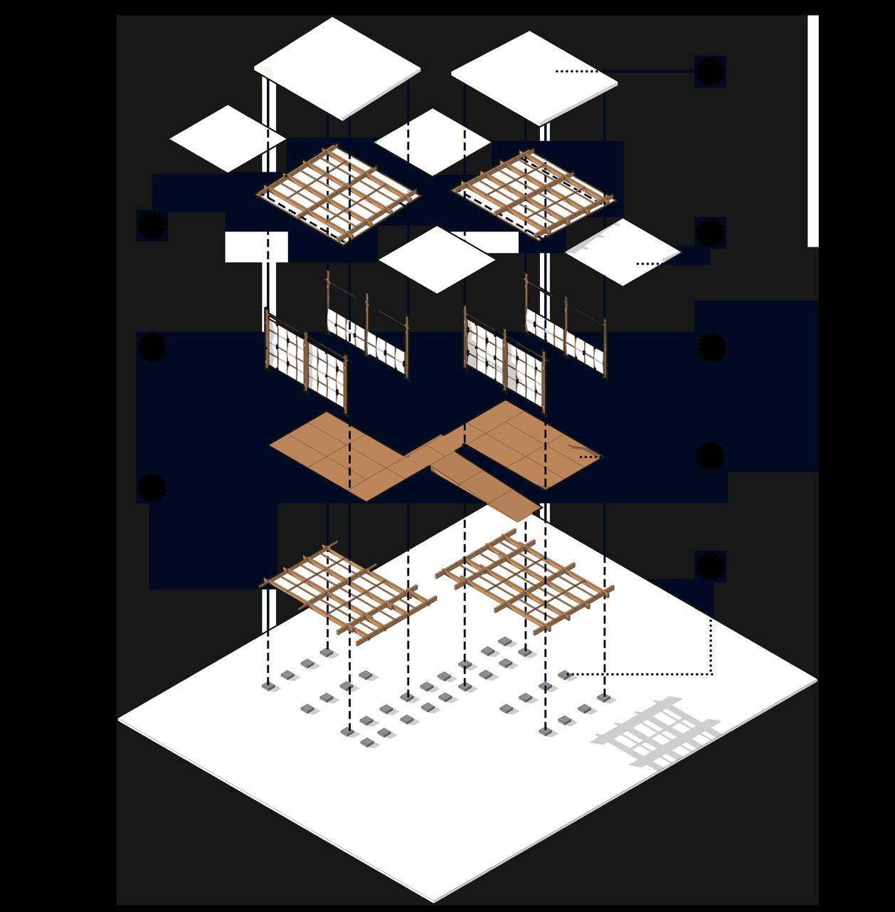
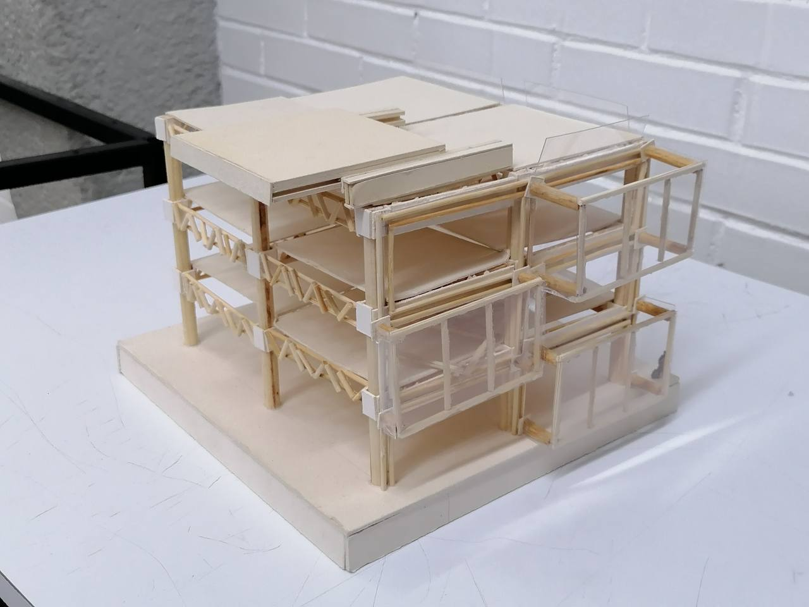
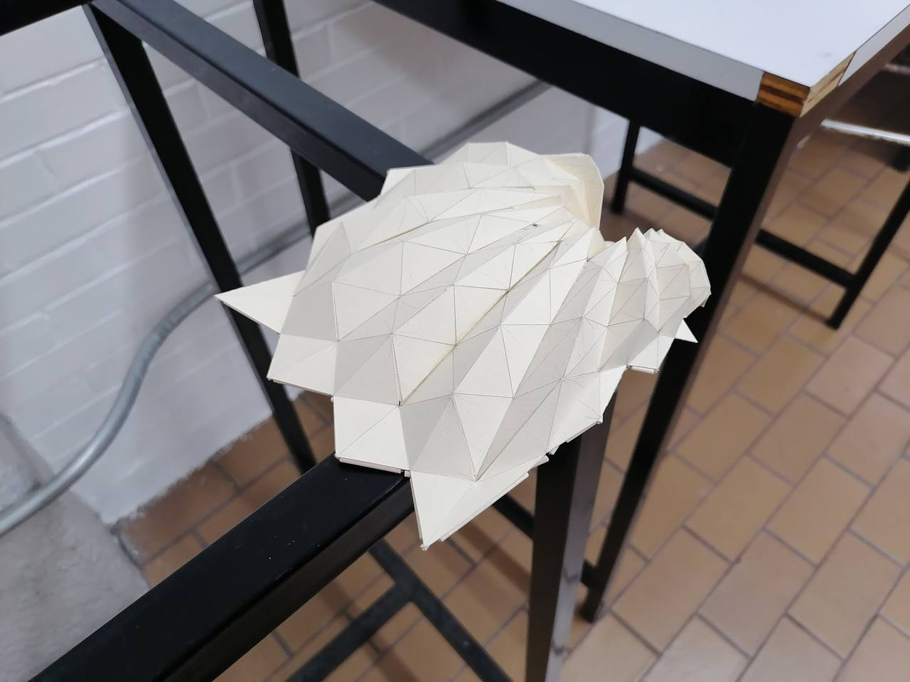

## Extending the classroom
Kúbito was conceived for Patio de los Huesitos at UNAM's School of Architecture, a transition point between Metro Copilco, the School of Engineering and Las Islas. It turns an everyday route into open infrastructure for studying, resting, eating and academic activities.

## Adaptable system
A modular structural grid supports dry assembly and phased growth. The roof and side panels fold to create shade, partially enclose the pavilion or free its edges, allowing several activities to take place at the same time.

## Recognition
The proposal received an honorable mention in the Intertalleres competition at UNAM's School of Architecture. Its name refers to the ulna —cúbito in Spanish— linking the pavilion's geometry to the identity of the courtyard.

## Gallery

