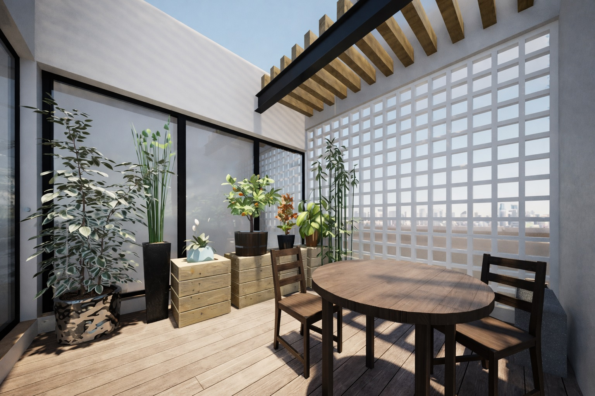
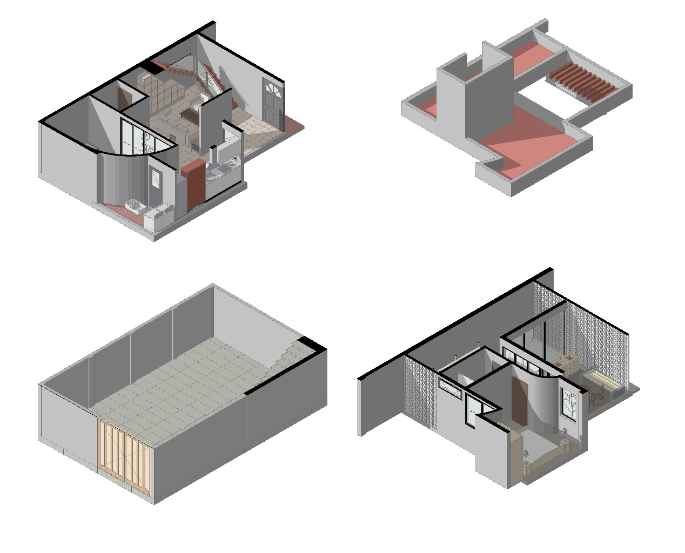

# Aurora House · Querétaro · Residencial · 2024

Aurora House es una vivienda contemporánea diseñada para maximizar el aprovechamiento de un terreno con condicionantes reales. Debido a la presencia de muros medianeros que limitan la apertura de vanos en planta baja, el proyecto desplaza el protagonismo hacia el segundo nivel, integrando luz y ventilación de manera más eficiente y mejorando el confort interior.

La propuesta busca una conexión clara entre interior y exterior mediante patios y aperturas controladas, generando espacios luminosos y habitables. En la cubierta, el roof garden transforma el techo en un espacio de esparcimiento y relajación, pensado como una extensión funcional de la casa.

El sistema constructivo con losacero permite una estructura resistente y ligera, favoreciendo soluciones viables y preparadas para futuras adaptaciones.

## Concepto arquitectónico
El diseño responde a restricciones de fachada y colindancias mediante una estrategia de elevación: reducir dependencias de iluminación frontal en planta baja y aprovechar el segundo nivel para capturar iluminación natural, ventilación y privacidad. La volumetría se mantiene sobria y contemporánea, priorizando claridad espacial, funcionalidad y una relación interior–exterior basada en patios y recorridos simples.

## Programa arquitectónico
- Acceso principal
- Área social (sala / estancia)
- Cocina y comedor integrados
- Patio(s) como fuente de iluminación y ventilación
- Recámara(s) y servicios en niveles superiores
- Roof garden (terraza habitable)
- Área de servicio / almacenamiento (según requerimientos del cliente)

## Notas adicionales
Proyecto residencial desarrollado por CR Collective con enfoque en soluciones reales: responder a las limitaciones del sitio, optimizar el presupuesto y generar espacios contemporáneos con potencial de crecimiento y adaptación a futuro.

## Galería

