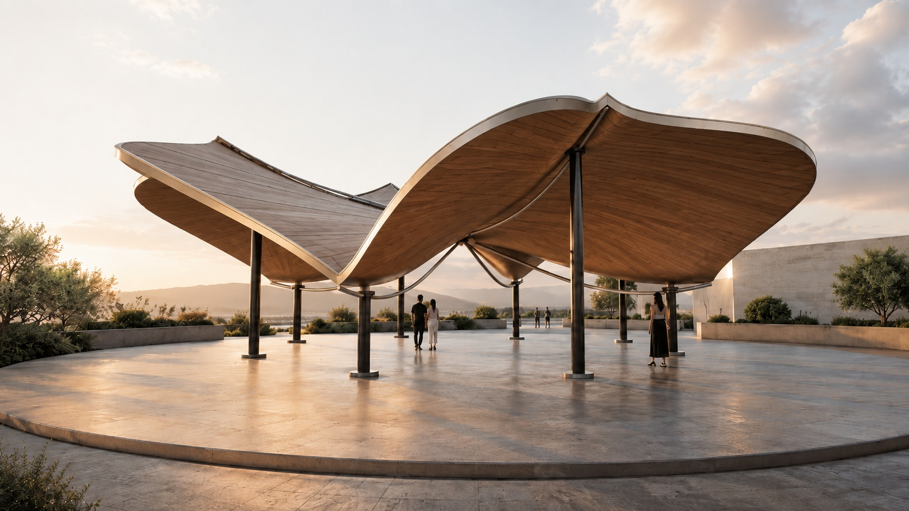
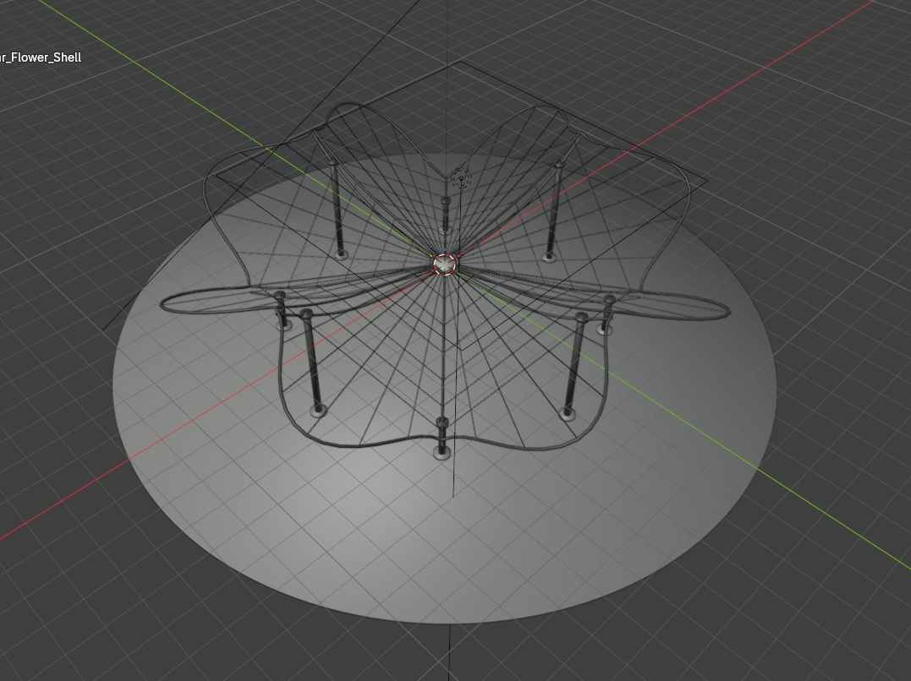
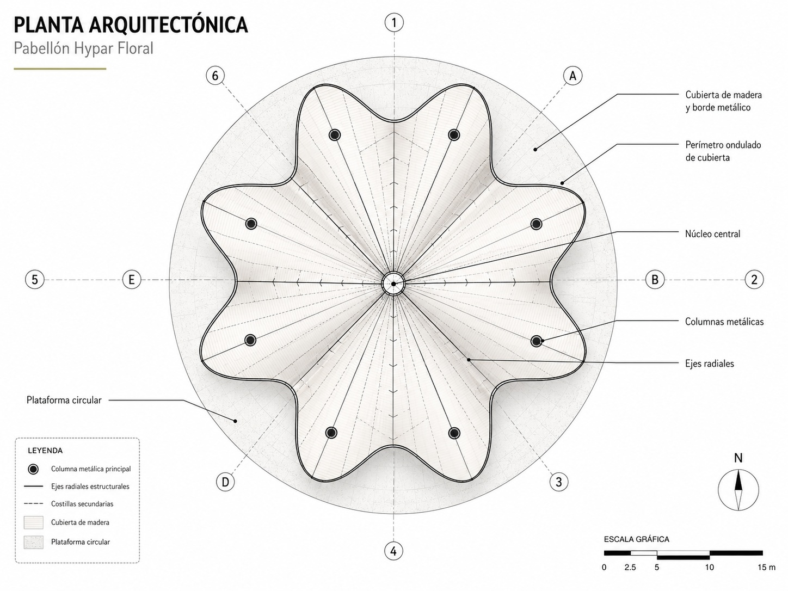
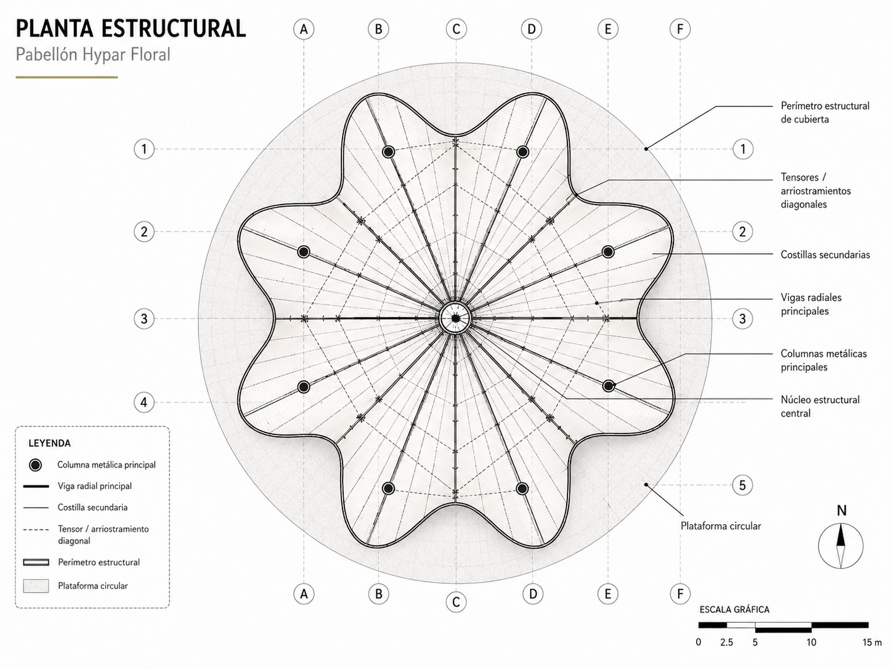
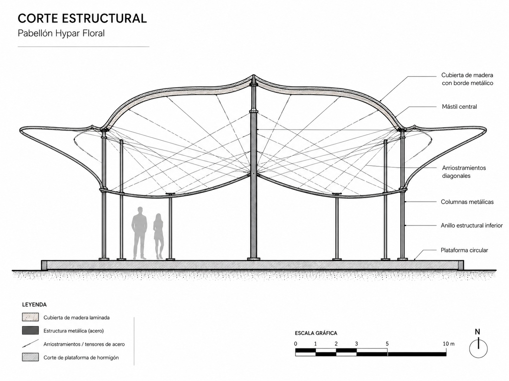

## Concepto
Brisa Pavilion es una propuesta arquitectónica para un pabellón ligero de carácter turístico y contemplativo, ubicado en la Riviera Nayarit. El proyecto nace como una estructura abierta al paisaje, pensada para ofrecer sombra, descanso y reunión en un entorno costero donde la relación con el viento, la luz natural y las vistas al mar define la experiencia espacial.

## Cubierta y atmósfera
La cubierta se concibe como el elemento principal: una pieza orgánica de geometría radial inspirada en superficies tipo hypar, reinterpretadas mediante una estructura ligera de madera y metal.

## Programa arquitectónico
- Plataforma circular de estancia para reunión, espera, descanso o contemplación.
- Zona central de sombra bajo la cubierta principal.
- Áreas perimetrales abiertas orientadas hacia el paisaje.
- Espacio flexible para reuniones ligeras y experiencias de hospitalidad.
- Circulación abierta de 360 grados.

## Sistema estructural
El sistema se resuelve mediante componentes ligeros: estructura metálica, borde perimetral rígido, costillas radiales, tensores diagonales y recubrimientos de madera laminada o paneles curvados.

## Galería

