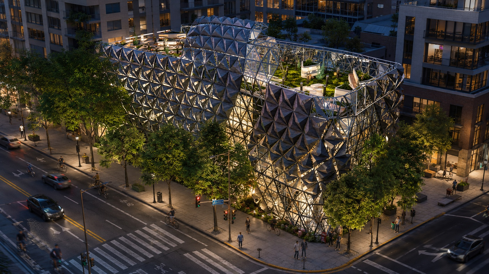
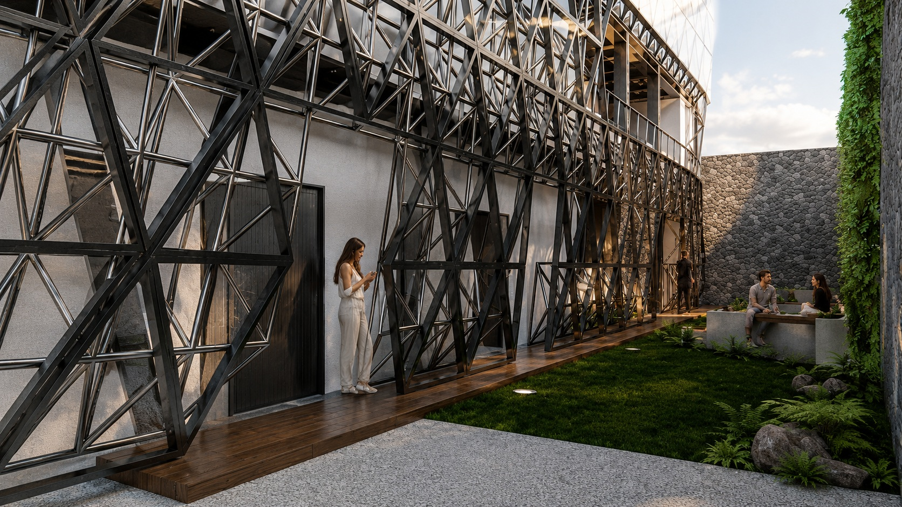
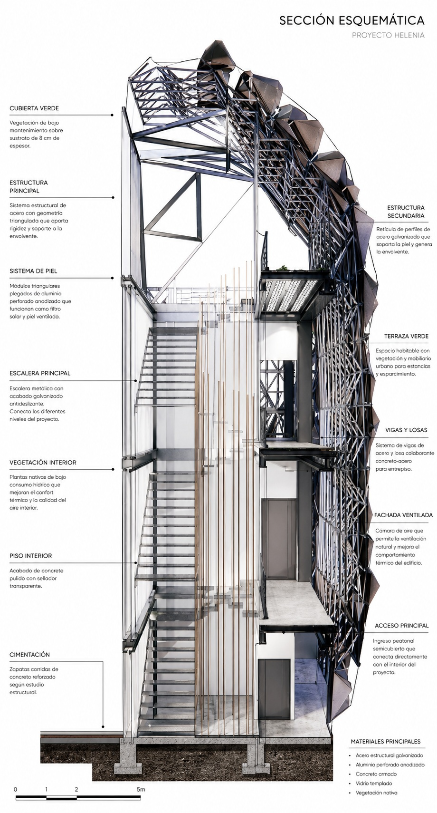
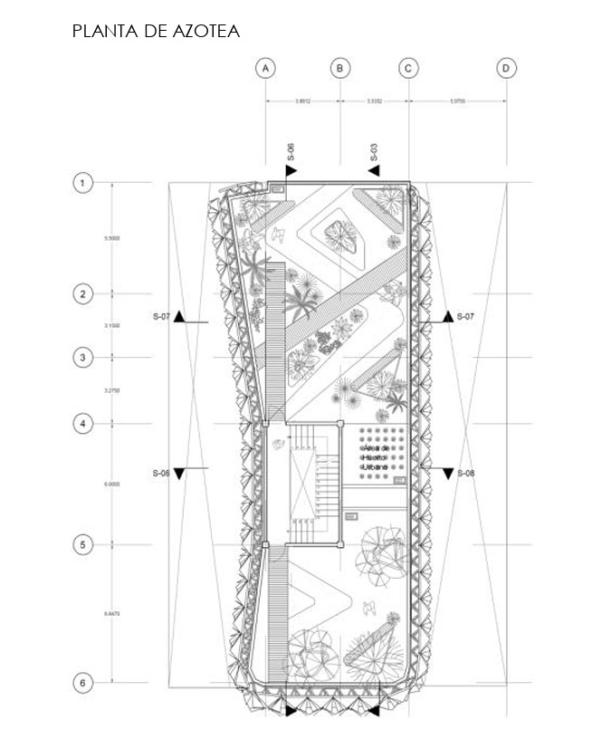
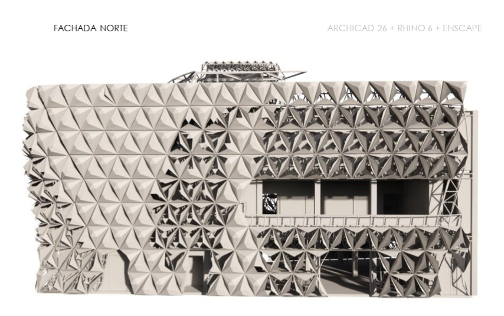
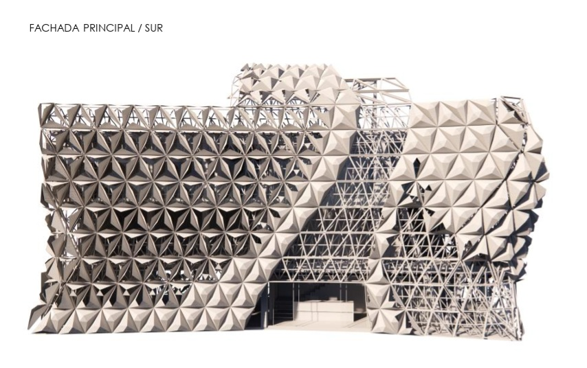

# Helenia Atelier · Calzada de Taxqueña, Ciudad de México · Atelier social · 2023

## Propósito
Helenia Atelier es una propuesta arquitectónica ubicada en las cercanías de Calzada de Taxqueña, concebida como un espacio de trabajo, aprendizaje y capacitación para mujeres en situación de vulnerabilidad interesadas en integrarse al campo de la costura y la confección.

El proyecto entiende el taller como una infraestructura de apoyo: un lugar donde la arquitectura contiene procesos productivos, pero también acompaña dinámicas de aprendizaje, colaboración y autonomía económica.

## Concepto
El nombre toma inspiración de una ciudad mencionada en la obra de Italo Calvino, estableciendo una relación entre ciudad imaginada, refugio productivo y espacio de transformación social.

Bajo esta premisa, el edificio se plantea como un taller contemporáneo donde la materialidad, la luz y la envolvente construyen una identidad vinculada al oficio textil.

## Participación de CR Collective
CR Collective participó en el desarrollo de la propuesta estructural de fachada: una envolvente de acero con paneles triangulados que evocan el movimiento, los pliegues y la tensión de la tela.

Esta piel metálica opera como una segunda estructura expresiva. Protege, filtra la luz y da presencia urbana al proyecto sin perder relación con el trabajo manual que le da sentido.

## Colaboración
La propuesta fue desarrollada en colaboración con los arquitectos Mario Alejandro Suárez Rodríguez y Diego López González, integrando arquitectura, estructura, materialidad y narrativa social en un mismo gesto formal.

## Galería

