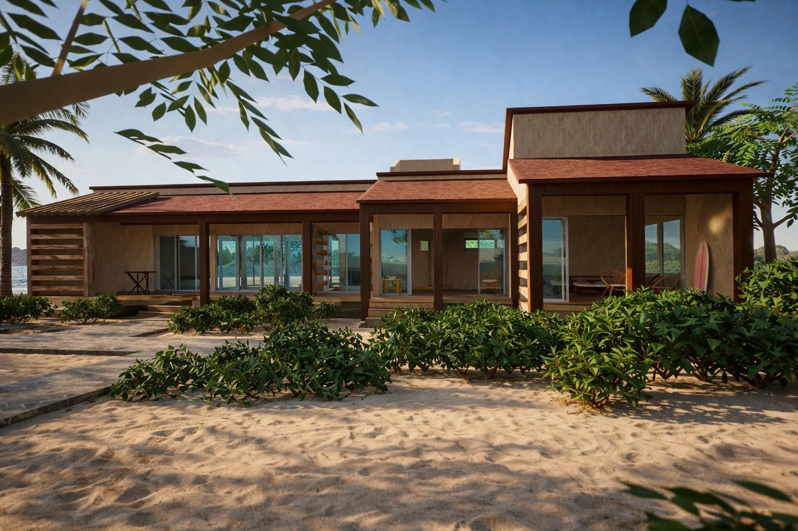
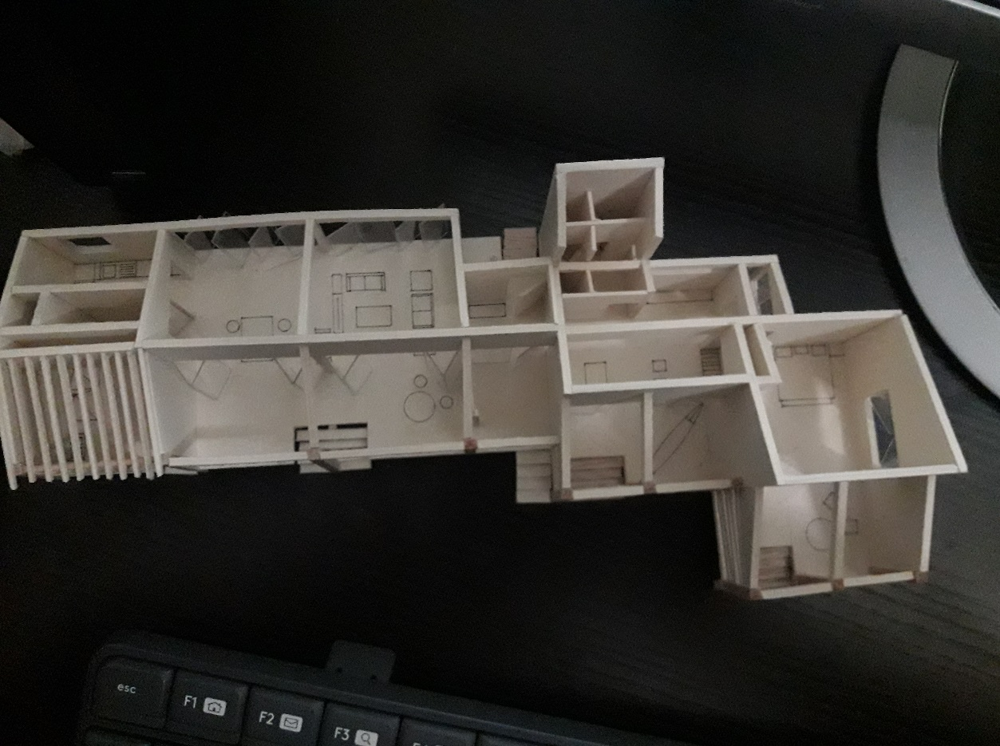

# Zicatela Surf Retreat · Oaxaca, México · Hospitalidad · 2019

Complejo de cabañas tropicales frente al mar, concebido como un retiro de playa con atmósfera relajada y fuerte conexión interior–exterior. El proyecto organiza volúmenes de un nivel con terrazas y porches sombreados, integrando circulación peatonal sobre arena y vegetación costera para enmarcar vistas y recorridos hacia el paisaje.

## Concepto
La propuesta busca un equilibrio entre simplicidad constructiva y experiencia sensorial de playa, priorizando:
- Vida al exterior: terrazas, pórticos y áreas de estancia abiertas
- Sombra y confort térmico mediante cubiertas, volados y elementos filtrantes
- Relación visual constante con el entorno (mar / vegetación) a través de grandes vanos
- Implantación ligera sobre el terreno con recorridos claros y zonas de reunión

## Estrategias de diseño
- Volumetría modular: unidades alineadas y conectadas por pórticos para ordenar el conjunto
- Materialidad cálida: madera aparente, acabados neutros y cubiertas en tonos tierra para armonizar con el sitio
- Transparencia controlada: cancelería amplia para iluminación natural y sensación de amplitud
- Paisajismo costero: vegetación baja como filtro, borde y transición entre arena y arquitectura
- Espacios comunes: palapa / pabellón abierto como punto social y de sombra

## Elementos clave
- Diseño conceptual arquitectónico
- Implantación y organización del conjunto
- Definición de materialidad y acabados (madera, tonos arena, cubiertas)
- Modelado 3D y representación para presentación
- Ambientación y propuesta de mobiliario exterior (terrazas / palapa)

## Galería

