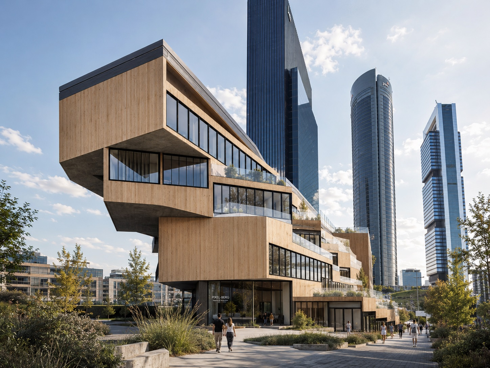
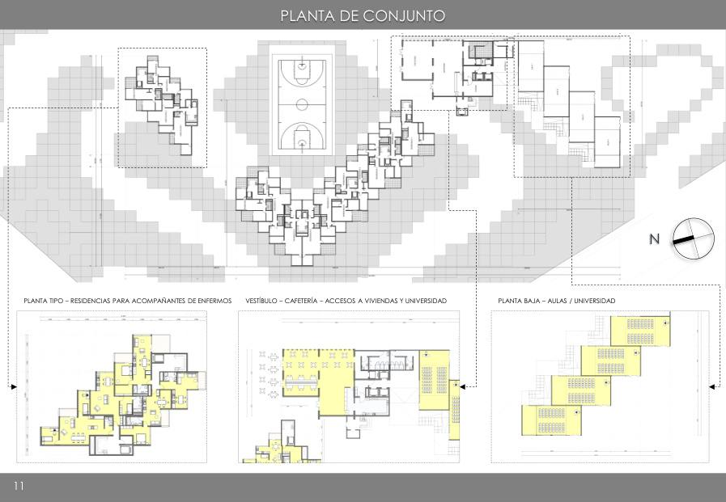

## Contrapunto urbano
Pixel-Berg es un estudio académico desarrollado en Madrid. La propuesta se coloca en el centro de las cinco torres del Paseo de la Castellana y utiliza un bloque horizontal, escalonado y poroso como contrapunto a la verticalidad del entorno financiero.

## Programa colectivo
El proyecto reúne aulas universitarias, vestíbulo, cafetería, vivienda temporal para acompañantes de pacientes y un teatro experimental para 200 espectadores.

## Sección y recorrido
La forma nace de una secuencia de plataformas, voladizos y núcleos que organiza las circulaciones en sección.

## Galería

