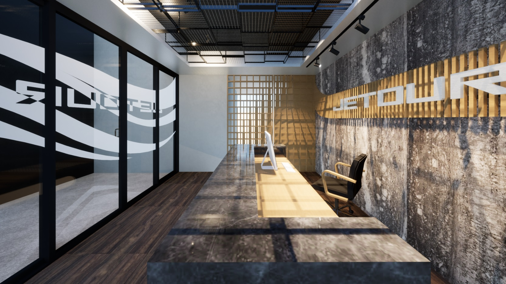
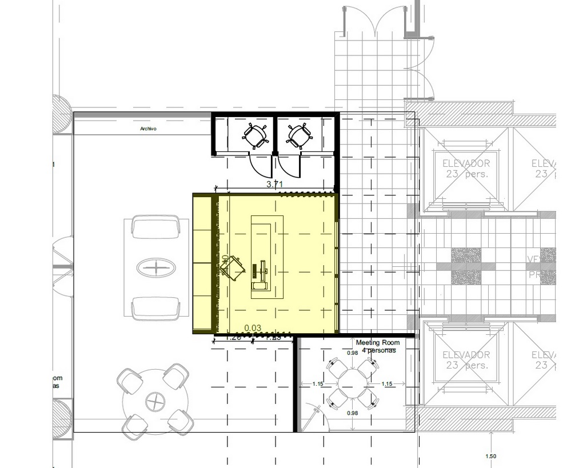
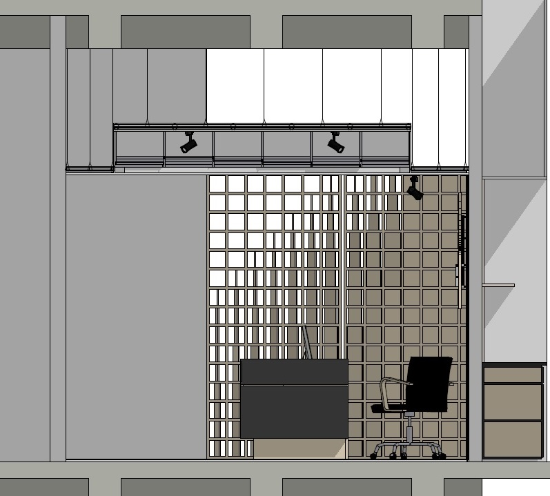

# Prisma Office – Corporativo – Santa Fe, CDMX – 2026

Intervención integral de acabados para el acceso principal y recepción de Prisma Office dentro de un piso corporativo en Santa Fe. El proyecto parte de un espacio en obra gris ya definido por la envolvente existente, y propone una identidad interior contemporánea que combina calidez, precisión geométrica e industrialidad, elevando la experiencia de llegada con una atmósfera sobria y tecnológica.

La propuesta se enfoca en: control de vistas desde el pasillo de elevadores, lectura clara del acceso, una composición protagonista en el muro de fondo y un plafón escultórico que refuerza el carácter de marca sin saturar el espacio.

## Concepto
La propuesta conceptual se construye con la idea de onda (flujo / frecuencia / movimiento): una geometría sutil que atraviesa el espacio y se expresa en tres niveles:

- Luz y ritmo: iluminación lineal indirecta y acentos puntuales para resaltar textura y marca.
- Trama industrial: plafón de rejilla metálica escalonada que evoca mecanicidad y precisión.
- Calidez orgánica: celosías y listones de madera con variaciones sutiles que filtran luz y generan profundidad.

## Elementos clave
- Acceso con cancelería de 4 hojas (2 fijos laterales + 2 deslizables centrales) y película opaca con diseño gráfico.
- Celosía lateral fija con patrón orgánico que permite el paso de luz y genera privacidad.
- Celosía lateral móvil (dos hojas) que, al cerrarse, se integra como una sola composición; al abrirse, habilita el acceso a oficinas.
- Muro de fondo con placas tipo piedra flexible montadas sobre tablaroca existente.
- Lienzo de marca con tiras de madera que forman una onda, con letras principales al frente e iluminación dirigida.
- Plafón protagónico: paneles de rejilla metálica en bastidores, organizados en escalonamiento tipo “olas”, enmarcados por un cajillo perimetral de tablaroca.
- Piso en porcelanato / loseta cerámica tipo madera (formato 20x90 o equivalente según especificación final), para balancear textura mineral + madera.

## Alcance del trabajo
- Diseño conceptual y desarrollo de propuesta de acabados.
- Modelado 3D y coordinación de elementos especiales (herrería, carpintería, recubrimientos, cancelería).
- Definición de materiales, especificaciones y criterios de instalación.
- Entrega de BIMx con vistas, recorridos y láminas del proyecto para aprobación y ejecución.

## Materialidad sugerida
- Madera: encino natural (acabado semi mate o brillante según selección final).
- Metal: estructura negra / grafito (bastidores de plafón y herrajes ocultos).
- Piedra flexible: textura mineral en tonos grises, formato modular.
- Cristal: cancelería con película (vinil esmerilado / opaco) con diseño a medida.
- Piso: porcelanato o cerámico tipo madera para calidez y resistencia.

## Galería

