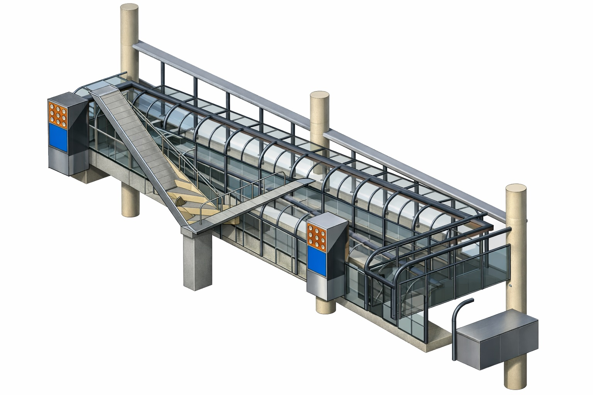
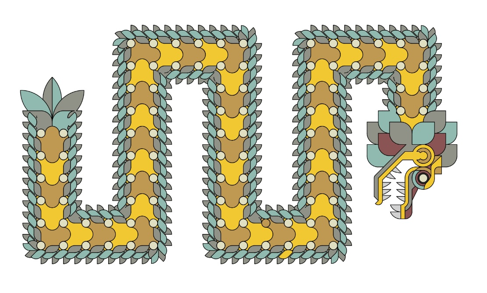
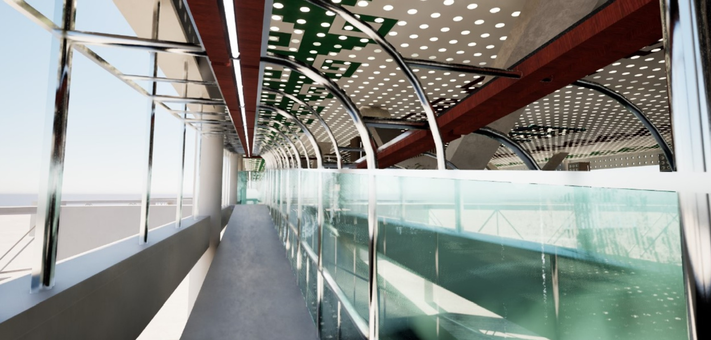
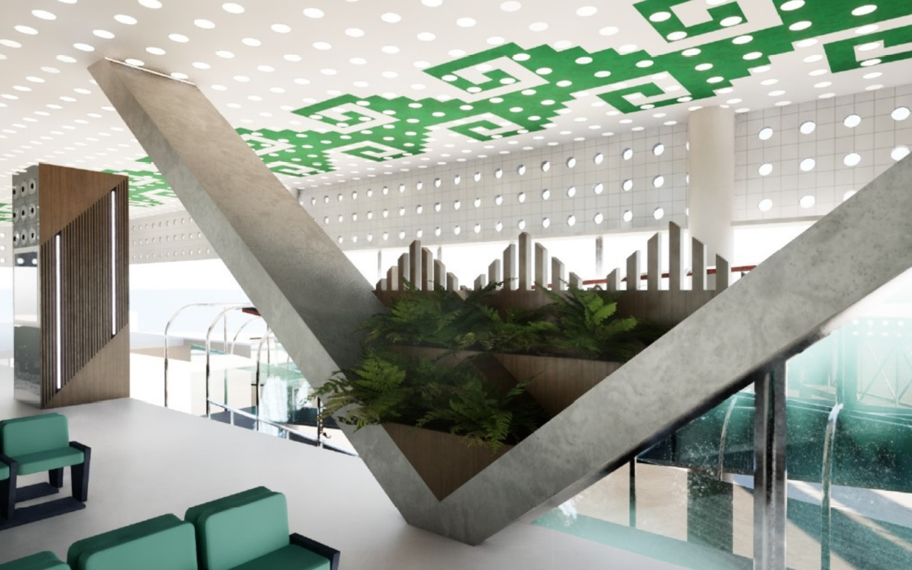
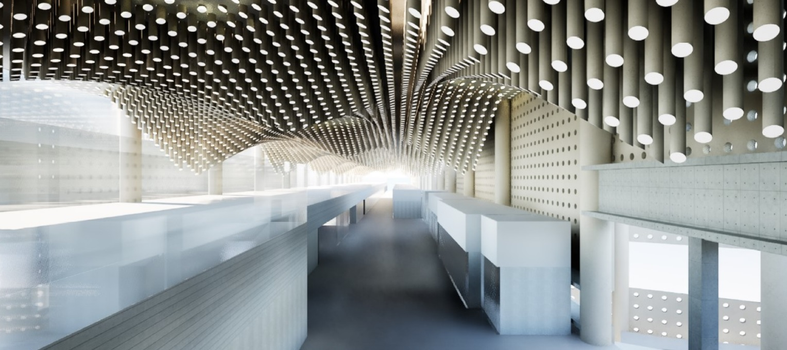
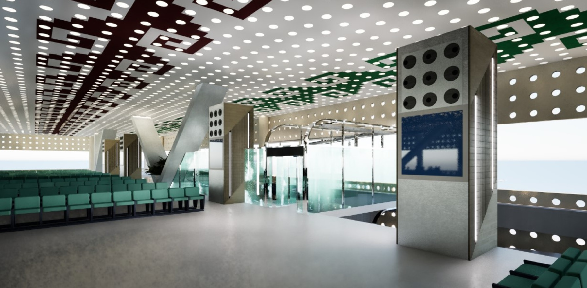
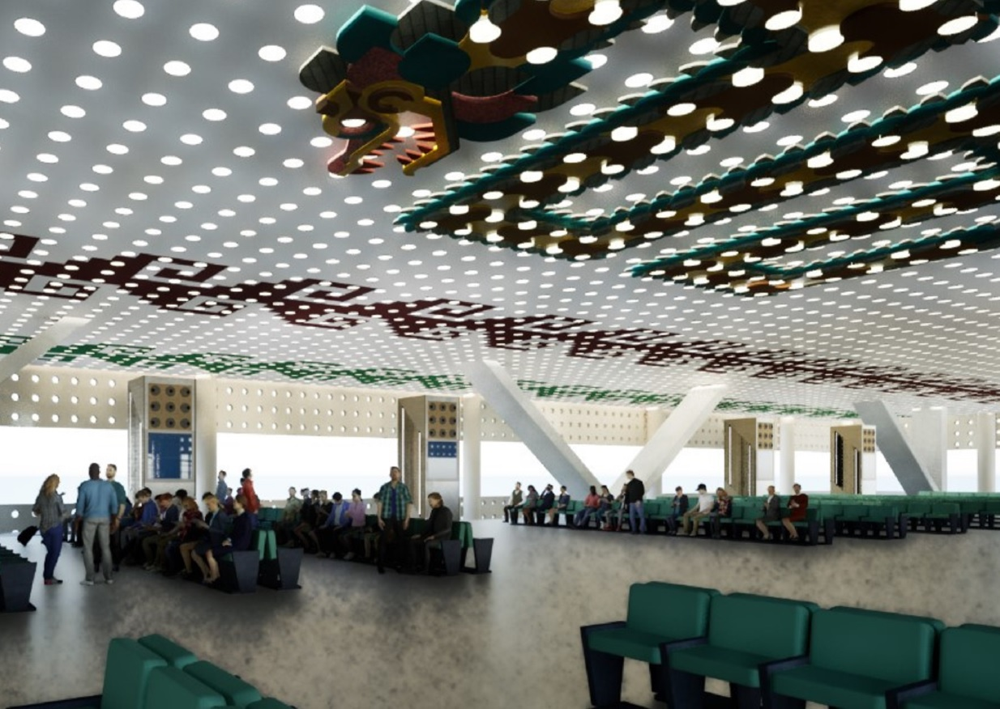

# Dedo Norte – Terminal 2 del AICM · Remodelación Interior · 2024

## Descripción general
Proyecto conceptual desarrollado en colaboración con el arquitecto Guillermo Olvera Jiménez para renovar la imagen interior del Dedo Norte y el ambulatorio principal de la Terminal 2 del Aeropuerto Internacional de la Ciudad de México. Se consideraron lineamientos aeroportuarios, flujo de pasajeros, iluminación, señalización y una nueva lectura espacial acorde al contexto del Mundial 2026.

## Concepto
La propuesta plantea una actualización estética y funcional mediante:
- Nuevos materiales
- Mejoramiento de la iluminación general e indirecta
- Ejes visuales más claros
- Integración de patrones y geometrías para dar identidad al espacio
- Reorganización perceptual sin afectar la operación aeroportuaria

## Elementos clave
- Diseño interior conceptual
- Texturas, acabados y materialidad sugerida
- Modelado y representación 3D para presentación a cliente
- Integración con criterios aeroportuarios

## Galería

